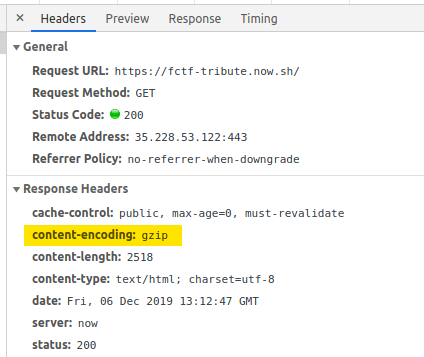

## TL;DR

```
curl https://fctf-tribute.now.sh/ -H 'Accept-Encoding:gzip' | gzip --list --name
```

## А вот и разгадка

Форма на странице просит: "Say my name". ASCII-арт товарища Гейзенберга нужен исключительно как отсылка к сериалу Breaking Bad, разгадки в нём нет.

Скрипт на странице нужен исключительно для проверки правильного ответа без запросов к серверу, выковырять его оттуда возможности нет.

На самом деле, ни в чём, что можно увидеть в странице или в отладчике, разгадки нет.

_Какого чёрта? А где же она?_

Она есть в ответе сервера, но не в HTML-коде.

## Content-Encoding

Наверняка, для вас не секрет, что большая часть хтмлок с (правильно настроенных) серверов летит в сжатом виде.



Вообще ничего необычного для 2k19.

Правда вас могло насторожить, что ради статической страницы я поднимал сервер на zeit. И что ответ прилетает будучи сжатым GZIP, а не более современным Brotli.

А что вообще значит, "ответ сжат гзипом"?

## Gzip

Это значит, что когда мы запрашиваем `index.html` в ответ нам прилетает архив GZIP, в котором лежит единственный файл.

Браузер незаметно для нас этот архив распаковывает, а его содержимое показывает как страницу.

И обычно в архивах можно указать имя для файла, который лежит внутри. Вот и в архивах GZIP тоже можно! Хотя обычно в UNIX-подобных операционках это имя игнорируется, а в браузере и подавно.

## Как узнать имя?

Браузер нам его не покажет :)

Придётся воспользоваться curl:

```
$ curl https://fctf-tribute.now.sh/
You're getting closer!
```

В ответ прилетает не то же самое, что в браузер - это была подсказка!

Теперь скажем серверу, что желаем получить GZIP, как и в браузере.

```
$ curl https://fctf-tribute.now.sh/ -H 'Accept-Encoding:gzip'
Warning: Binary output can mess up your terminal. Use "--output -" to tell
Warning: curl to output it to your terminal anyway, or consider "--output
Warning: <FILE>" to save to a file.
```

Получили сам архив, а не его содержимое. Теперь как узнать имя? Три варианта:

- Позволить курлу вывести бинарь в терминал:


- С использованием утилиты `file`:


- Сказать архиватору GZIP вывести имя:


## Итого

Страница просила ввести её имя - её имя файла в архиве GZIP, который фактически прилетает с сервера при запросе страницы.
